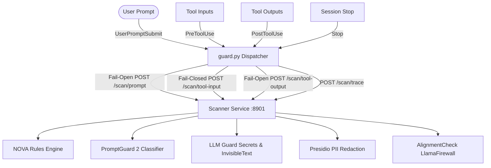
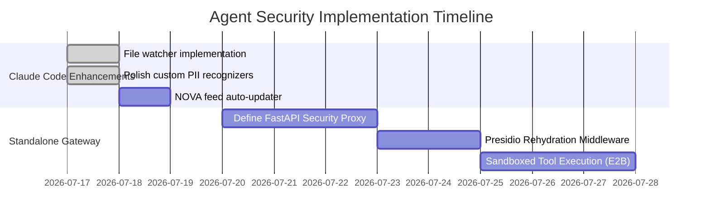

# Security Assessment & Standalone Agent Security Plan

This document evaluates the existing security harness for **Claude Code** and provides a roadmap for enhancing it. It also outlines architecture patterns and tool integration strategies for protecting **standalone agents**.

---

## 1. Validation & Analysis of Current Harness

The current setup implements a multi-layered security architecture with a **persistent local scanner service** (`scanner_service.py`) and a **thin hook dispatcher** (`guard.py`). 



### Key Strengths of Current Design
1. **Persistent Warm Scanner (Performance)**: Resolves the multi-second startup delay of loading SpaCy models and Hugging Face pipelines on every CLI invocation.
2. **Asymmetric Fail-Safes**:
   - *Fail-open* on `UserPromptSubmit` to prevent blocking the developer session if the scanner crashes.
   - *Fail-closed* on `PreToolUse` for outbound tool calls (`mcp__` and `Bash`), minimizing data egress risk.
3. **Multi-Engine Strategy**: Combines pattern-matching (NOVA), heuristics (LLM Guard), ML classification (PromptGuard 2), and PII anonymization (Presidio).
4. **Out-of-Band Hard Hardening**: Uses Claude Code’s native `permissions.deny` blocklist to restrict critical commands (e.g. piping curl to bash, accessing SSH/AWS directories), which is non-bypassable by hooks.

### Identified Gaps & Recommendations

> [!WARNING]
> **1. Lack of Dynamic Rule Reloading** (Fixed in Repo!)
> The scanner service loads NOVA rules from `~/.claude/nova-rules/*.nov` only at startup. If rule files are updated, the daemon must be restarted manually.
> *Recommendation*: Implement a file watcher or dynamic modification time check in `scanner_service.py` to hot-reload rule objects.

> [!IMPORTANT]
> **2. Presidio Polish/Regional Restrictions** (Fixed in Repo!)
> By default, Presidio lacks recognizers for Polish-specific data formats (like NIP, PESEL, Polish ID cards, or local phone formats).
> *Recommendation*: Add a custom `PatternRecognizer` dictionary to the AnalyzerEngine initialization in `scanner_service.py`.

> [!NOTE]
> **3. PromptGuard 2 Gating & Authentication**
> Meta's `Llama-Prompt-Guard-2-22M` model requires Hugging Face credentials and accepting a user license. Without it, the prompt-injection scoring silently disables.
> *Recommendation*: Add a clear diagnostic endpoint or CLI output notifying the user if PromptGuard is inactive.

---

## 2. Enhancing the Claude Code Harness: Proposed Additions

Here is a concrete plan to augment the current harness:

| Target Component | Proposed Security Feature | Rationale |
| :--- | :--- | :--- |
| **PII Scanners** | Custom Polish Recognizers (PESEL/NIP) (Completed) | Ensures local compliance under GDPR for organizations handling EU/Polish data. |
| **Observability** | Structured Hook Auditing & Alerts | Move from `/tmp` logs to structured JSON lines (`~/.claude/security_audit.jsonl`) with levels (`INFO`, `WARN`, `ALERT`) for SIEM consumption. |
| **Rule Feeds** | Automate NOVA rules updates | Integrate a shell script or cron task utilizing `threatfeeds-to-nova` to pull active jailbreaks and injection patterns weekly. |
| **MCP Hardening** | MCP Server Permissions Sandboxing | Block unvetted MCP servers using a strict `allowedMcpServers` array in the managed settings configuration. |

---

## 3. Security Architecture for Standalone Agents

When building standalone agents (using LangChain, CrewAI, AutoGPT, or custom agent loops), you must decouple the security layer from specific client hooks. Below are three primary patterns.

### Pattern A: Gateway/Proxy Pattern (Recommended)
Intercept LLM API traffic at the network level. All requests to OpenAI, Anthropic, or local endpoints pass through a security proxy.

```
┌──────────────┐         ┌──────────────┐         ┌──────────────┐
│  Agent Loop  │ ──────► │ Security     │ ──────► │ LLM API      │
│  (Python/JS) │ ◄────── │ Proxy (API)  │ ◄────── │ (Anthropic)  │
└──────────────┘         └──────────────┘         └──────────────┘
                             ▲      ▲
                             │      │
                      LLM Guard    Presidio
```
* **Pros**: Simple to enforce across multiple agents; isolates secret keys; acts as a unified logging layer.
* **Cons**: Introduces mild network latency; requires self-hosting the proxy.

### Pattern B: Middleware / Interceptor Pattern
Embed security logic directly in the agent's application code via decorators, hooks, or event listeners.

```python
# Conceptual LangChain/Custom agent wrapper
class SecureAgent:
    def __init__(self, agent_instance, scanner_client):
        self.agent = agent_instance
        self.scanner = scanner_client
        
    def step(self, user_input):
        # 1. Input Guard (Jailbreak + Secrets check)
        check = self.scanner.scan_prompt(user_input)
        if check.is_blocked:
            raise SecurityException(f"Blocked: {check.reason}")
            
        # 2. Run agent step
        response = self.agent.run_step(user_input)
        
        # 3. Output Guard (Exfiltration check)
        sanitized_response = self.scanner.scan_response(response)
        return sanitized_response
```

### Pattern C: E2B / Sandboxed Sandbox Pattern
Execute all agent-generated code, shell commands, and local file manipulations inside an isolated sandbox (like **E2B Sandbox**, **Docker**, or **Wasmtime**).
* **Why**: Prompt injection detection is never 100% effective. Sandboxing guarantees that even if an agent is successfully injected and tries to run `rm -rf /` or exfiltrate directories, it only runs within an ephemeral, memory-limited micro-VM with restricted network access.

---

## 4. Evaluation of Agent Security Frameworks

For standalone agents, you should combine the following frameworks depending on your strictness requirements:

### 1. **Microsoft Presidio (PII & Data Sanitization)**
* **Role**: Detects and redacts PII/sensitive info.
* **Standalone Usage**: Combine `AnalyzerEngine` with a custom `Rehydration` map. 
  - Before sending text to the LLM, map `"John Smith"` $\rightarrow$ `"<PERSON_1>"`.
  - When the LLM returns the output, map `"<PERSON_1>"` back to `"John Smith"`. This preserves context while shielding private data from third-party LLM providers.

### 2. **LLM Guard (Comprehensive Guardrails)**
* **Role**: Quick scanning of prompts and outputs using fast, lightweight local models or regex engines.
* **Key Scanners for Standalone**:
  - `llm_guard.input_scanners.Secrets` (essential for preventing agents from reading or leaking `.env` values).
  - `llm_guard.output_scanners.URL` (prevents indirect injection exfiltration by sanitizing generated links).
  - `llm_guard.output_scanners.JSON` (forces output structure consistency).

### 3. **NOVA-Hunting (Adversarial Detection)**
* **Role**: Rules-based scanning of prompt contexts.
* **Standalone Usage**: Integrate `nova-hunting` directly into the agent’s memory retrieval step. When tools fetch webpages, search results, or vector DB chunks, run the text through `NovaMatcher` before appending it to the context window.

### 4. **NeMo Guardrails (NVIDIA) (Dialog & Intent Control)**
* **Role**: Restricts agents to topical boundaries, manages dialogue flows, and enforces system instructions.
* **Standalone Usage**: Excellent if your agent uses LangChain. You define rails (in `.co` files) specifying which topics are off-limits (e.g. "do not discuss competitor pricing").

### 5. **Llama Guard 3 & Prompt Guard (Classifier Models)**
* **Role**: Multi-class safety classification.
* **Standalone Usage**: Fast, self-hosted safety classification (Llama Guard 3 is highly capable for safety category checks, while Prompt Guard is highly optimized for jailbreak classification).

---

## 5. Implementation Action Plan


